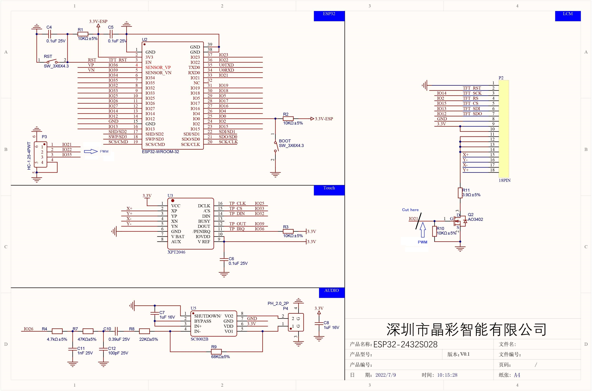

# Hardware — CYD Heating Remote 2 zones

## Module ESP32-2432S028R (CYD)

Le module CYD intègre sur une seule carte :
- ESP32-WROOM-32, dual-core 240 MHz, 4 Mo flash, WiFi 802.11 b/g/n
- Écran TFT ILI9341 320 × 240 px, interface SPI interne
- Contrôleur tactile résistif XPT2046, interface SPI secondaire
- Connecteur JST-PH 1.25mm 4 broches (P3) — accès GPIO
- Connecteur microUSB — programmation + alimentation 5V
- LDR (GPIO34) — capteur de luminosité ambiante
- LED RGB (GPIO 4/16/17)



### Firmware usine

Le CYD est livré avec un **firmware de démonstration LVGL** affichant
une galerie interactive de widgets : boutons, sliders, jauges, graphiques,
listes déroulantes. La bibliothèque TFT_eSPI gère le rétroéclairage
directement sur **GPIO22** (`TFT_BL`) en ON/OFF simple — pas de PWM,
luminosité fixe à 100%. La LDR (GPIO34) n'est pas exploitée.

### Broches utilisées dans ce projet

| Signal | GPIO | Remarque |
|---|---|---|
| Touch XPT2046 IRQ | 36 | Entrée uniquement |
| Touch XPT2046 MOSI | 32 | |
| Touch XPT2046 MISO | 39 | Entrée uniquement |
| Touch XPT2046 CLK | 25 | |
| Touch XPT2046 CS | 33 | |
| Rétroéclairage | 22 | ON/OFF via TFT_eSPI — PWM si modification strap |
| LDR | 34 | Optionnel — exploitation future |

---

## Modification optionnelle — Contrôle PWM luminosité

Cette modification n'est **pas indispensable** pour le fonctionnement
du projet — l'écran s'allume normalement sans elle. Elle apporte :

- **Variation de luminosité** par PWM : `ledcWrite(22, valeur)` de 0 à 255
- **Adaptation automatique** possible via la LDR (GPIO34)

### Contexte schéma

Sur le CYD, le transistor **Q2 (AO3402)** commande le rétroéclairage TFT.
Sa grille est reliée à **IO21** via **R10 (10kΩ pull-down vers GND)**.
R10 maintient Q2 bloqué en l'absence de signal.

TFT_eSPI active le rétroéclairage via **GPIO22** (`TFT_BL`) — mais cette
broche n'est pas câblée vers Q2 en interne. Pour exploiter le PWM
depuis le firmware, il faut relier GPIO22 à la grille de Q2.

```
Avant modification :
  GPIO22 (TFT_BL) ──► [TFT_eSPI ON/OFF interne] ──► rétroéclairage fixe

Après modification :
  GPIO22 ──[strap]──► Grille Q2 ──[R10 pull-down]──► GND
                                  Q2 drain ──► rétroéclairage PWM
  IO21 ──[piste coupée]── (déconnecté de R10)
```

### Procédure

> ⚠️ Opération délicate sur composants CMS — loupe ou binoculaire recommandé.

#### Matériel

| Outil | Détail |
|---|---|
| Fer à souder | Weller, pointe fine type 7 ou 8 |
| Soudure | Soudure à l'argent (fusion plus basse) |
| Fil souple | Câblage fin, dénudé ~2mm aux extrémités |
| Colle | Cyanoacrylate (super glue) |
| Mini-perceuse | Type Dremel, foret fin |

#### Étape 1 — Couper la piste IO21 → R10

Près de R10, percer **sans traverser** le PCB pour couper la piste en surface.
Vérifier au multimètre : pas de continuité IO21 → R10.

#### Étape 2 — Poser le strap IO22

Le connecteur P3 est CMS pas 1.25mm — très proche du plastique.

**Ordre impératif :**
1. Préparer un fil souple ~3cm, dénudé 2mm aux extrémités
2. **Coller le fil en premier** sur le PCB (entre broche 2 de P3 et point R10)
3. Laisser sécher
4. **Souder ensuite** — côté R10 d'abord, puis broche 2 de P3 (contact bref)

#### Vérification

| Test | Résultat attendu |
|---|---|
| IO21 → R10 | Pas de continuité |
| IO22 → R10 | Continuité |
| PWM | `ledcWrite(22, 128)` → luminosité ~50% |

---

## Programmation

> ⚠️ **Toujours débrancher le connecteur d'alimentation** avant de
> connecter le câble USB de programmation.

Le 5V USB remonte vers la sortie du convertisseur AC/DC si les deux
sont connectés simultanément — risque d'endommager le module d'alimentation.

```
1. Couper l'alimentation secteur
2. Débrancher le connecteur d'alimentation du CYD
3. Connecter le câble USB
4. Programmer
5. Débrancher USB
6. Rebrancher l'alimentation
7. Remettre le secteur
```

---

## Façade avant

Voir [`hardware/panel/`](panel/) pour les fichiers de la façade.

## Alimentation

Produit séparé — voir
[Alimentation-230VAC-5V-9V-DC-5W](https://github.com/Papymakers/Alimentation-230VAC-5V-9V-DC-5W)
